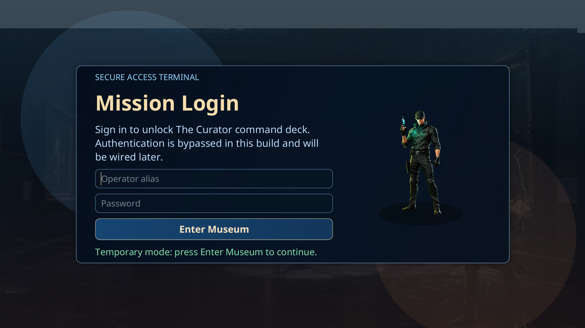
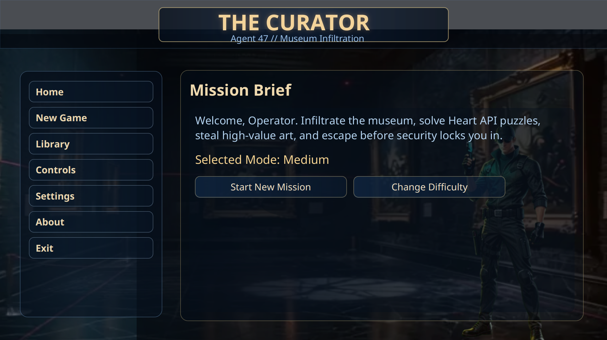
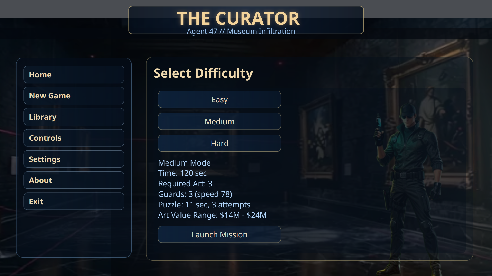
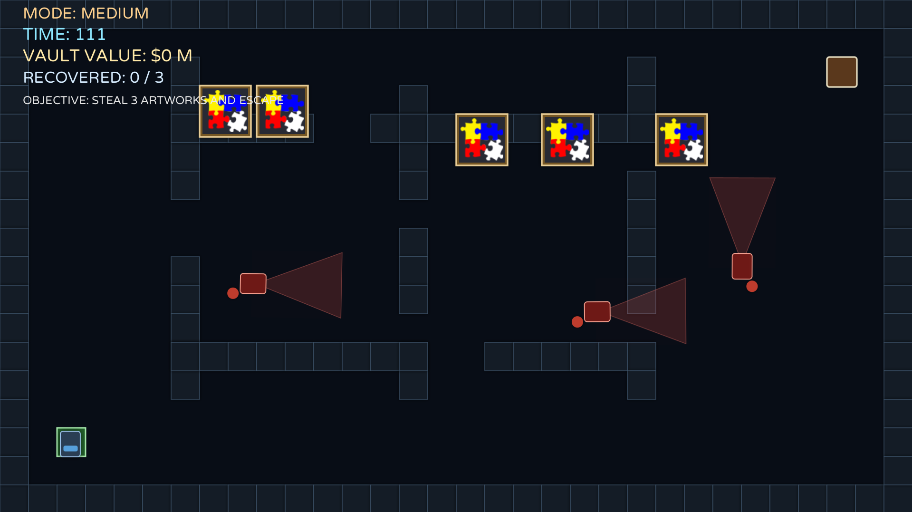
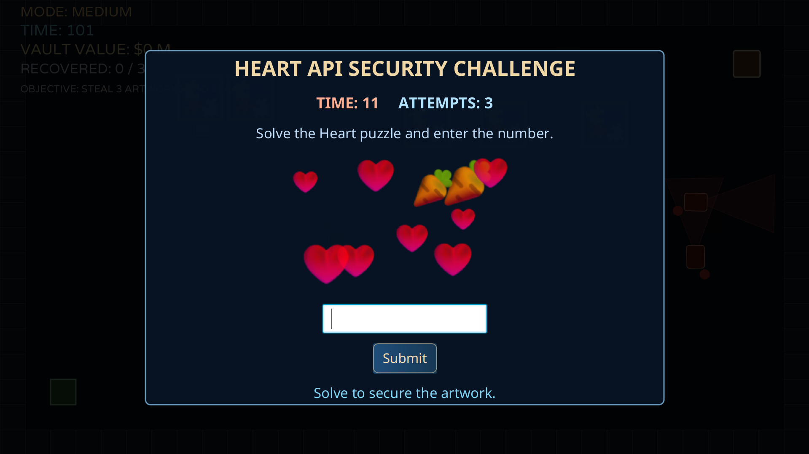
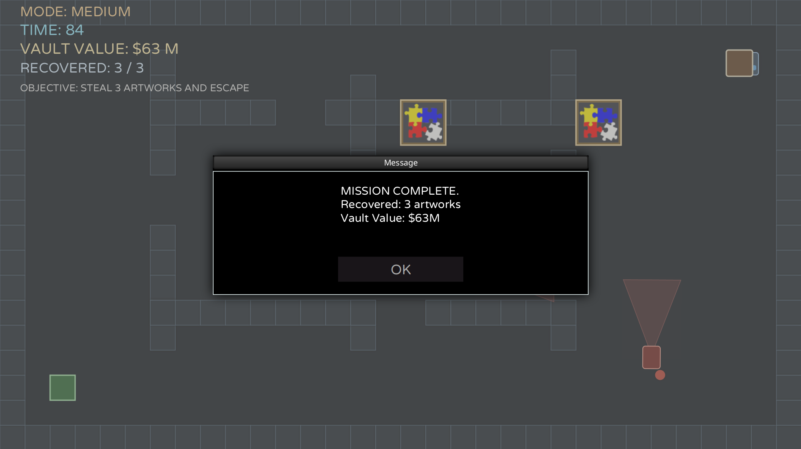

# 🎮 The Curator

> **A cinematic stealth-heist game built with Java + FXGL**
>
> Infiltrate a high-security museum, solve live puzzle challenges, recover high-value artwork, and escape before time runs out.

[](https://openjdk.org/projects/jdk/21/)
[](https://maven.apache.org/)
[](https://github.com/AlmasB/FXGL)
[](LICENSE)

---

## 📚 Table of Contents

- [✨ Highlights](#-highlights)
- [🧩 Core Gameplay Loop](#-core-gameplay-loop)
- [🎯 Difficulty Profiles](#-difficulty-profiles)
- [🕹️ Controls](#️-controls)
- [🛠️ Tech Stack](#️-tech-stack)
- [🌐 External Integrations](#-external-integrations)
- [🧱 Project Structure](#-project-structure)
- [🚀 Getting Started](#-getting-started)
- [🧠 Architecture Overview](#-architecture-overview)
- [🖥️ Display & Scaling](#️-display--scaling)
- [🖼️ Gallery](#️-gallery)
- [🧪 Reliability Notes](#-reliability-notes)
- [🛟 Troubleshooting](#-troubleshooting)
- [🗺️ Roadmap](#️-roadmap)
- [📄 License](#-license)

---

## ✨ Highlights

- 🔐 **Animated login-first flow** before entering the command deck (mock auth mode).
- 🧭 **Premium multi-panel main menu** (Home, New Game, Library, Controls, Settings, About).
- 🕵️ **Stealth gameplay loop** with patrol guards and detection cones.
- 🧩 **Heart API challenge** on each artwork interaction.
- 🖼️ **Live museum artwork sourcing** from the Art Institute of Chicago API.
- 📚 **Persistent session vault** to track recovered artworks and total value.
- 🧠 **Difficulty scaling** across Easy / Medium / Hard with tuned mission parameters.
- 🖥️ **Responsive display support** with fullscreen startup + resize scaling.

---

## 🧩 Core Gameplay Loop

1. Enter through the login screen.
2. Choose mission difficulty.
3. Navigate museum corridors while avoiding guard vision.
4. Interact with artworks to trigger puzzle challenge.
5. Solve puzzle to secure the artwork.
6. Reach exit after meeting required artwork quota.
7. Mission result is saved to session vault.

---

## 🎯 Difficulty Profiles

| Mode | Mission Time | Required Art | Guards | Puzzle Time | Attempts | Art Value Range |
|---|---:|---:|---:|---:|---:|---:|
| Easy | 160s | 2 | 2 | 14s | 2 | $10M - $16M |
| Medium | 120s | 3 | 3 | 11s | 3 | $14M - $24M |
| Hard | 90s | 4 | 4 | 8s | 4 | $20M - $34M |

---

## 🕹️ Controls

| Action | Key |
|---|---|
| Move | `W A S D` or Arrow Keys |
| Open menu / pause | `ESC` |
| Toggle fullscreen | `F11` |
| Trigger puzzle | Touch artwork |

---

## 🛠️ Tech Stack

- ☕ **Java 21**
- 🎮 **FXGL 17.3** (game loop, scenes, entities, input, physics)
- 🧱 **JavaFX** (UI rendering and transitions)
- 📦 **Maven** (build and dependency management)
- 🔎 **Gson** (JSON parsing)
- 🌐 **Java HttpClient** (remote API requests)

---

## 🌐 External Integrations

### 🖼️ Art Institute of Chicago API
- Fetches live artwork metadata and image IDs.
- Converts image IDs to IIIF image URLs.
- Includes local fallback generation when API/network is unavailable.

### ❤️ Heart API
- Fetches puzzle challenge JSON from HEART API.
- Validates numeric answers client-side.
- Includes offline arithmetic fallback puzzle if API is unavailable.

---

## 🧱 Project Structure

```text
TheCurator/
├── .mvn/
├── LICENSE
├── README.md
├── pom.xml
├── system/
│   ├── fxgl.bundle
│   └── Readme.txt
└── src/
    └── main/
        ├── java/
        │   └── com/
        │       └── curator/
        │           ├── EntityType.java
        │           ├── Launcher.java
        │           ├── MuseumFactory.java
        │           ├── TheCuratorApp.java
        │           ├── components/
        │           │   └── PatrolComponent.java
        │           ├── model/
        │           │   ├── GameMode.java
        │           │   └── StolenArtRecord.java
        │           ├── services/
        │           │   ├── HeartService.java
        │           │   └── MuseumService.java
        │           ├── state/
        │           │   └── GameSession.java
        │           └── ui/
        │               ├── HackingSubScene.java
        │               └── PremiumMainMenu.java
        └── resources/
            └── assests/
                ├── menu/
                │   ├── menu_bg.png
                │   └── thief.png
                ├── screenshots/
                │   ├── 01-login-screen.png
                │   ├── 02-main-menu-home.png
                │   ├── 03-difficulty-selection.png
                │   ├── 04-stealth-gameplay.png
                │   ├── 05-heart-api-puzzle.png
                │   └── 06-mission-complete.png
                └── video/
                    └── background.mp4
```

> Note: The resource folder name is intentionally `assests` in the current project structure and code paths.

---

## 🚀 Getting Started

### 1) Prerequisites

- Java 21+
- Maven 3.8+
- Internet connection (optional but recommended for live artwork + puzzle APIs)

### 2) Clone

```bash
git clone https://github.com/perera99-msd/The-Curator.git
cd The-Curator
```

### 3) Run

```bash
mvn clean javafx:run
```

### 4) Build

```bash
mvn clean package
```

---

## 🧠 Architecture Overview

- `TheCuratorApp`: Main game lifecycle (settings, input, world, UI, collisions, mission flow).
- `PremiumMainMenu`: Login overlay + premium animated menu navigation.
- `HackingSubScene`: Timed puzzle overlay with attempts + result callback.
- `MuseumFactory`: Entity creation for player, guards, walls, art, and doors.
- `PatrolComponent`: Guard pathing and vision-direction rotation behavior.
- `MuseumService`: Artwork feed loading and fallback generation.
- `HeartService`: Puzzle retrieval/validation and fallback challenge.
- `GameSession`: Shared session state, selected mode, settings flags, and vault data.

---

## 🖥️ Display & Scaling

- Starts in fullscreen by default.
- Supports window resize while preserving aspect ratio.
- Uses FXGL scaling for consistent layout between small screens and large displays.
- `F11` toggles fullscreen/windowed mode at runtime.

---

## 🖼️ Gallery

### Login & Menu

| Login Screen | Main Menu |
|---|---|
|  |  |

| Difficulty Selection |
|---|
|  |

### Gameplay

| Stealth Gameplay | Heart API Puzzle |
|---|---|
|  |  |

| Mission Complete |
|---|
|  |

---

## 🧪 Reliability Notes

- If external APIs fail or are unreachable, gameplay still continues using fallback data.
- Puzzle timeout and attempt limits are mode-based and enforced in real time.
- Mission success requires meeting quota **and** reaching exit.

---

## 🛟 Troubleshooting

- If the app does not launch:
  - Verify Java version with `java -version` (must be 21+).
  - Verify Maven with `mvn -version`.
- If online images/puzzles do not load:
  - Check internet connectivity.
  - The game should still continue via fallback content.
- If UI looks too zoomed:
  - Toggle `F11` to switch fullscreen/windowed.
  - Resize window; scaling is handled automatically.

---

## 🗺️ Roadmap

- ✅ Login-first flow (mock mode)
- ⏭️ Real authentication backend integration
- ⏭️ Additional levels and guard AI patterns
- ⏭️ Soundtrack/SFX polish and HUD refinement
- ⏭️ Save/load profile support

---

## 📄 License

Distributed under the **MIT License**. See [LICENSE](LICENSE) for full text.
