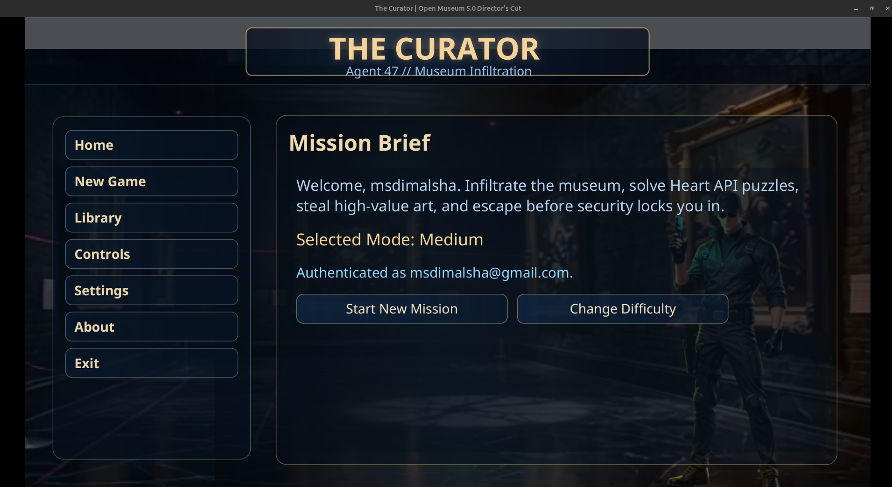
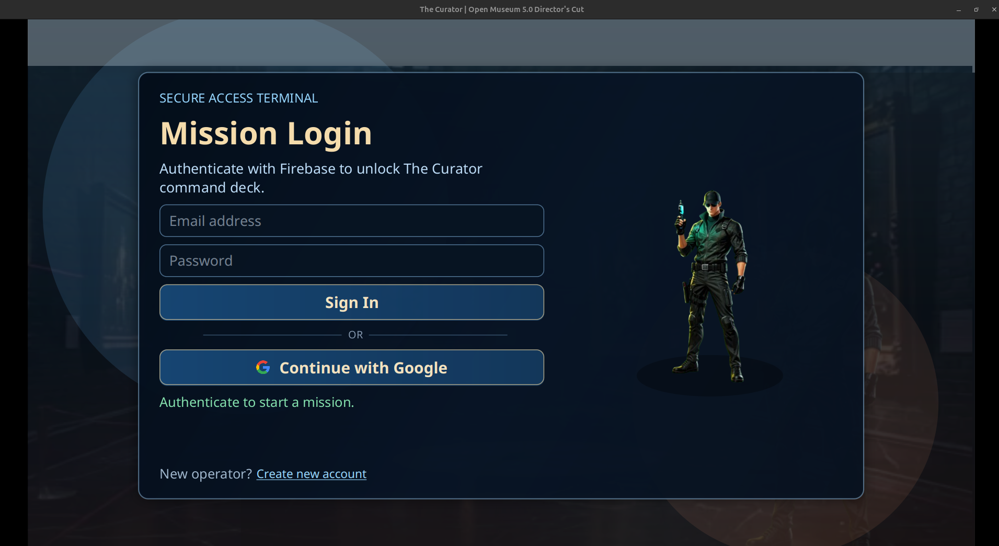
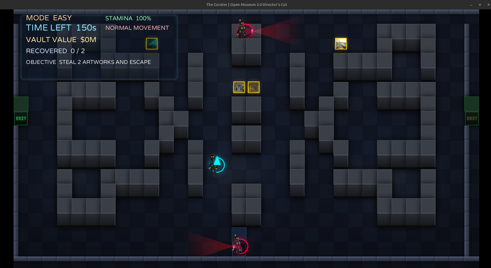
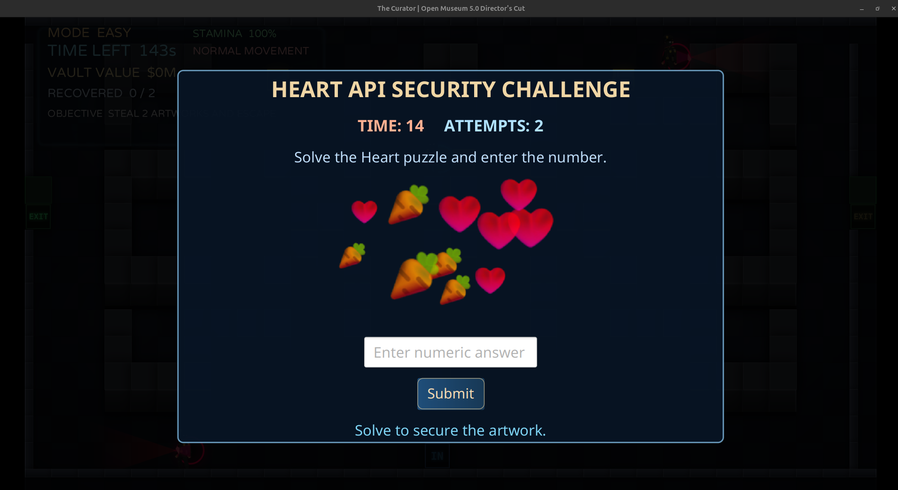
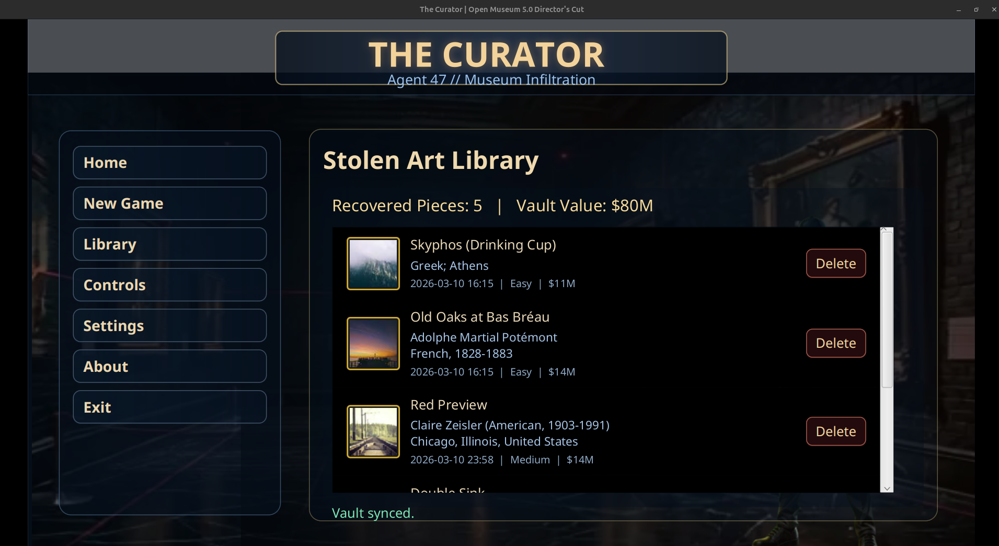

# 🎮 The Curator

> **A premium stealth-heist museum game built with Java 21 + FXGL 17.3**

`The Curator` is a top-down stealth experience where you infiltrate a guarded museum, secure valuable artwork through puzzle interactions, and extract before time expires.

---

## ✨ Key Features

- 🕵️ **Stealth gameplay loop** with patrol guards and line-of-sight detection.
- 🧱 **Hardened collision system** (player/guards cannot pass through walls and solid doors).
- 🧭 **Improved guard routing** with wall-aware patrol behavior.
- 🖼️ **Premium museum visuals** (enhanced backdrop, effects, animated elements).
- 🚪 **Door interaction system** with real exit, fake exit, locked interior doors, and start door.
- 🧩 **Puzzle sub-scene integration** for artwork acquisition.
- 🎚️ **Difficulty scaling** across Easy / Medium / Hard.
- ☁️ **Service-oriented architecture** with cloud-ready repositories and fallback implementations.

---

## 🔁 Core Gameplay Flow

1. 🚪 Start from the menu and launch a mission.
2. 🎯 Select difficulty.
3. 🧍 Navigate corridors while avoiding guards.
4. 🖼️ Interact with art and solve the puzzle popup.
5. 💰 Collect required artwork count.
6. ✅ Reach the real exit to complete the mission.

---

## 🎮 Controls

| Action | Keys |
|---|---|
| Move | `W A S D` or `↑ ↓ ← →` |
| Sprint | Hold `Z` |
| Sneak | Hold `C` |
| Interact (Art / Door) | `ENTER` |

---

## 🎯 Difficulty Configuration (Current)

| Mode | Time | Required Art | Guards | Art Spawns | Guard Speed | Puzzle Time | Attempts | Art Value (M) |
|---|---:|---:|---:|---:|---:|---:|---:|---:|
| EASY | 160s | 2 | 2 | 4 | 62 | 14s | 2 | 10–16 |
| MEDIUM | 120s | 3 | 3 | 5 | 78 | 11s | 3 | 14–24 |
| HARD | 90s | 4 | 4 | 6 | 96 | 8s | 4 | 20–34 |

_Source: `com.curator.domain.GameMode`._

---

## 🛠️ Tech Stack

- ☕ **Java 21**
- 🎮 **FXGL 17.3** + JavaFX
- 📦 **Maven**
- 🌐 **Java HttpClient**
- 🧾 **Gson**

---

## 🧱 Current Project Structure

> The tree below mirrors the repository layout as it appears on GitHub (root + key `src/` paths).

**Quick view (compact):**
```text
The-Curator/
├─ .env.local.example
├─ .gitignore
├─ LICENSE
├─ README.md
├─ pom.xml
├─ .idea/                # IDE settings (optional)
└─ src/
   └─ main/
      ├─ java/com/curator/{app,config,domain,gameplay,services,state,ui}
      └─ resources/
         ├─ firebase.properties
         └─ assets/
            ├─ textures/
            └─ screenshots/
```

<details>
  <summary><b>Click to expand (full tree)</b></summary>

```text
The-Curator/
├── .env.local.example
├── .gitignore
├── .idea/
├── LICENSE
├── README.md
├── pom.xml
└── src/
    └── main/
        ├── java/
        │   └── com/
        │       └── curator/
        │           ├── app/
        │           │   ├── Launcher.java
        │           │   ├── ServiceRegistry.java
        │           │   └── TheCuratorApp.java
        │           ├── config/
        │           │   └── FirebaseConfig.java
        │           ├── domain/
        │           │   ├── ArtData.java
        │           │   ├── AuthSession.java
        │           │   ├── GameMode.java
        │           │   ├── HeartPuzzle.java
        │           │   ├── HeistReport.java
        │           │   ├── StolenArtEntry.java
        │           │   ├── StolenArtRecord.java
        │           │   └── UserProfile.java
        │           ├── gameplay/
        │           │   ├── EntityType.java
        │           │   ├── MuseumFactory.java
        │           │   └── components/
        │           │       └── PatrolComponent.java
        │           ├── services/
        │           │   ├── AuthService.java
        │           │   ├── ArtProvider.java
        │           │   ├── HeistReportRepository.java
        │           │   ├── PuzzleProvider.java
        │           │   ├── StolenArtRepository.java
        │           │   ├── UserProfileRepository.java
        │           │   └── impl/
        │           ├── state/
        │           │   └── GameSession.java
        │           └── ui/
        │               ├── PremiumMainMenu.java
        │               ├── HackingSubScene.java
        │               ├── game/
        │               │   └── GameHud.java
        │               ├── library/
        │               │   └── LibraryPanel.java
        │               └── panels/
        └── resources/
            ├── firebase.properties
            └── assets/
                ├── textures/
                └── screenshots/
                    ├── LoginPage.png
                    ├── MainMenu.png
                    ├── MainGamePlay.png
                    ├── HearAPIPopUp.png
                    └── StolenArts.png
```

</details>

---

## 🖼️ Screenshots

<!--
  Notes:
  - Use relative paths so screenshots render on GitHub.
  - Keep widths consistent for a cleaner collage.
-->

<p align="center">
  
  
  
</p>

<p align="center">
  
  
</p>

<details>
  <summary><b>Image captions</b></summary>

- **Main Menu** — start a mission and choose difficulty.
- **Login** — authentication screen.
- **Gameplay** — top-down stealth navigation with guards.
- **Puzzle Popup** — hacking / puzzle sub-scene.
- **Stolen Arts** — collected artwork dashboard.

</details>

---

## 🚀 Build & Run

### Prerequisites

- JDK `21+`
- Maven `3.8+`

### Run (development)

```bash
mvn clean javafx:run
```

### Build

```bash
mvn clean package
```

---

## 🧠 Architecture at a Glance

- `TheCuratorApp` → game lifecycle, level generation, input, collision, mission flow.
- `MuseumFactory` → entity visuals, hitboxes, and gameplay entity construction.
- `PatrolComponent` → guard patrol motion + waypoint behavior.
- `HackingSubScene` → puzzle interaction and result callbacks.
- `ServiceRegistry` → wiring for API/auth/repository services.

---

## 📄 License

This project is licensed under the **MIT License**. See [LICENSE](LICENSE).